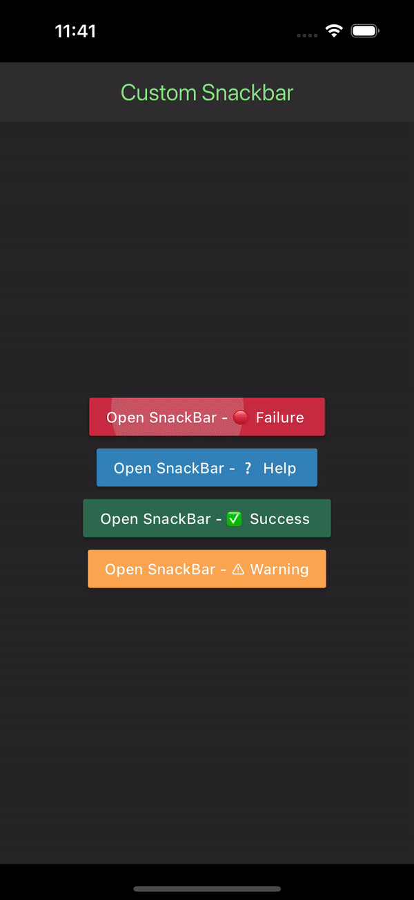

# Flutter Custom Snackbar App

This Flutter app demonstrates the implementation of custom SnackBars with different styles for various scenarios like failure, help, success, and warning.

## Features

- Displays four different styled SnackBars for failure, help, success, and warning scenarios.
- Clean and modern UI with a dark theme.
- Easy to understand and modify codebase.

## DEMO

## Getting Started

To run this app on your local machine, follow these steps:

1. Make sure you have Flutter installed on your machine. You can find the installation guide [here](https://flutter.dev/docs/get-started/install).
2. Clone this repository to your local machine using `git clone https://github.com/dcaayushd/Custom-Flutter-SnackBar.git`.
3. Navigate to the project directory using `cd Custom-Flutter-SnackBar`.
4. Run `flutter pub get` to install the required dependencies.
5. Connect a device or start an emulator/simulator.
6. Run `flutter run` to launch the app on your device/emulator.

## Contributing

Contributions are welcome! If you find any issues or have suggestions for improvements, please open an issue or submit a pull request.

## License

This project is licensed under the [MIT License](LICENSE).
